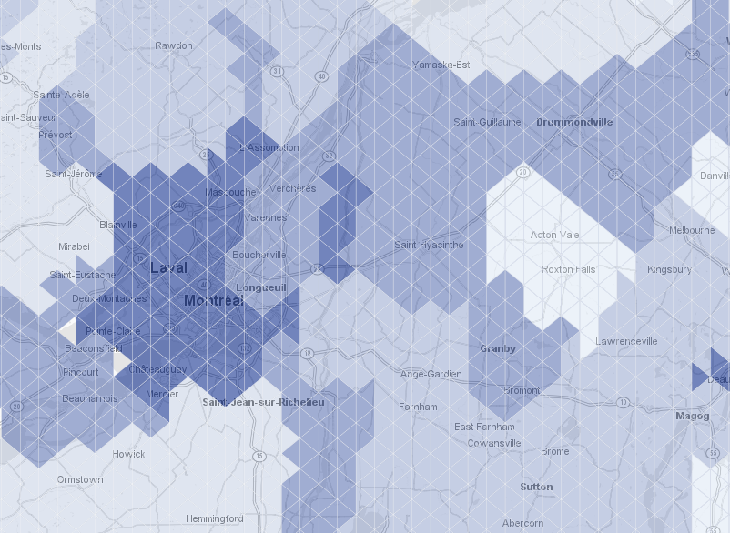

trigrid
=======

This little SQL function build a triangular grid like this kind

and result is like this

-- créer une table tirgrid pour l'Irak
 
drop table iraq_trigrid;
create table iraq_trigrid(gid integer,tx integer, ty integer);
SELECT AddGeometryColumn ('','iraq_trigrid','the_geom',4326,'POLYGON',2);
select trigrid (-150,36,100,44,0.13,4326,'iraq_trigrid');
CREATE INDEX sidx_trigrid ON iraq_trigrid USING GIST ( the_geom );
CREATE UNIQUE INDEX idx_trigrid_l1 ON iraq_trigrid (gid);
select count(*) from iraq_trigrid;
-- 605200
 

